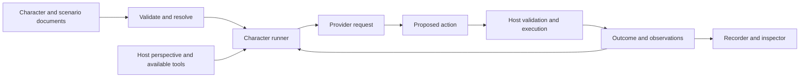

# Phase 2 host protocol and embodiment

Current alpha implementation and remaining scope are summarized in
[the release report](../release-alpha.md). This design remains a broader contributor
reference; current guides take precedence for supported commands and capabilities.

Status: draft design. Audience: contributors designing future releases.

M1/M2 implement a text/structured-data subset through `simkind/runner` and the
conversation/settlement reference hosts. See the [current contract and limits](../portable-scenarios.md#host-outcomes-and-recordings).
Embodiment, media, spatial profiles, and general replay/restore/branching remain
future work. The logical protocol below includes those broader targets.

This proposed contract extends the
[format architecture](schema.md) and [roadmap](../../roadmap.md). It is not the
current `SimkinRuntimeAdapter` API; see [current integration](../integration.md).
Exact function/type names remain implementation choices. The ownership and
execution semantics below are the target.

## Invariants

1. Characters receive a permitted perspective, not implicit access to all state.
2. A tool declaration does not grant permission. The host checks each invocation.
3. A model response, accepted action, and completed effect are separate events.
4. The host owns execution and authoritative records; physical measurements may
   still be incomplete or uncertain.
5. Bodies, graphics, and physical execution are independent optional properties.
6. Character strategy remains open. The protocol imposes no plan or social script.

## Logical architecture



The host descriptor advertises contract ID/version, supported profiles, tool
catalogs, clocks, observation types, action/cancellation support, and checkpoint
capabilities. Resolve compatibility before the first provider request or world
action. A schema-compatible tool name alone is not sufficient compatibility.

Logical host operations:

| Operation | Responsibility |
| --- | --- |
| Describe | Publish supported contracts, profiles, and lifecycle capabilities |
| Observe | Produce a character-specific projection at an identified revision/time |
| List available tools | Expose operations/argument constraints currently available to that character |
| Submit action | Revalidate and reject or accept a correlated proposal |
| Receive action events | Report progress, completion, failure, and uncertainty |
| Request cancellation | Report request receipt separately from actual cancellation |
| Export checkpoint | Produce a complete state at a supported boundary |
| Restore checkpoint | Validate compatibility and restore only when supported |

These are logical operations, not a requirement for HTTP, MCP, an RPC server,
or a particular process layout. In-process adapters are first-class.

## Character runner

The optional ready-made runner assembles permitted observations, selected memory
content, persona context, intentions, and tools. It invokes a provider outside
host execution and submits parsed proposals. Consequences become subsequent
context. Record the effective context and tool versions used for the request.

Hosts choose when decision opportunities arise: fixed intervals, events, idle
transitions, or a combination. Scheduling is a compute policy, not a character
strategy. Do not force a reflection/planning/negotiation sequence every tick.
Record optional policy IDs/versions and any context transformation.

The runner may use structured tool calls or provider-specific output formats.
Provider adapters translate supported schema subsets without weakening host
validation. Reject or disclose unsupported features rather than silently dropping
constraints. Keep OpenRouter, compatible endpoints, and local inference adapters
outside the core. Explicit model selection remains required.

## Observations and information access

An observation envelope identifies:

- `id`, `runId`, recipient instance ID, and source identifier;
- captured time, delivered time, and relevant host revision;
- optional subject/entity/frame references;
- content parts: text, typed structured data, or media references;
- optional measurement provenance/uncertainty under a profile.

Media references include content type, resolvable resource reference, and content
hash for stable recording where available. Record media actually supplied to a
model or mark it unavailable. Do not place entire sensor streams in every prompt.
The host/adapter chooses an explicit projection and records that choice.

Examples include a conversation utterance, a perceived object, an estimated
position, a camera image, a sound, or a tool's result. Distinguish captured and
delivered time so delayed observations remain identifiable.

The host's full state is not a character observation. Operator inspection may
show omniscient simulation data, but it must be labeled and must not leak into
character context. A hidden inventory or private conversation is disclosed only
through host-defined perception/communication rules. Physical hosts may have no
omniscient state at all.

## Tool contracts and proposal validation

Tool definitions contain ID, version/contract reference, description, input
schema, optional output schema, and lifecycle capabilities. Domain semantics
belong to the host profile. `walk_to`, `navigate_to`, `say`, and `transfer` are
examples, not mandatory universal tool names.

The proposal envelope binds actor instance, tool ID/version, arguments, originating
model request, observed host revision, and a unique action ID. The host validates
shape, actor permission, arguments, freshness, and contextual legality at execution.
A changed world may invalidate a proposal generated from an earlier observation.

The host defines whether revision drift means rejection or revalidation against
current state. It must not silently perform a different consequential action.
Return a structured reason suitable for character feedback and operator inspection.

A character's request to revise its intention or interpretation is another
permitted operation; it is not unrestricted write access to the state document.
Speech is content. It does not directly mutate the world merely because it claims
an action, obligation, or observation occurred.

## Asynchronous action lifecycle

Required distinctions:

```text
proposed -> rejected
         -> accepted -> running -> succeeded
                                -> failed
                                -> cancelled
```

`running` may be omitted for immediate operations. Rejection means the operation
was not admitted. Failure after acceptance may include partial effects, which
must be recorded. Terminal events carry result/error data and references to
actual effects. A model request becoming `fulfilled` does not complete a host
action.

Cancellation is a request, not a guaranteed transition. Emit cancellation-requested
and then report whether cancellation took effect, was unsupported, or arrived
after completion. Do not imply that a timeout undid an external effect.

When a remote/physical result is unknown, record an uncertainty event and keep
the operation unresolved. `unknown` is an epistemic status, not proof of failure.
The host may later reconcile it. Late completion remains recorded even if the
character has moved on; the host must prevent double application.

Action IDs correlate retries and results. Hosts advertise their deduplication
scope and durability. Do not claim universal exactly-once execution. Reusing an
ID with different arguments is an error. After an uncertain result, the runner
must not blindly resubmit a consequential operation under a new ID.

For multiple actions and agents, the host defines serialization and concurrency
rules. Record the actual accepted/committed order and any relevant randomness.
A character can continue receiving observations while an operation is running.

## Time and ordering

Separate three concepts:

| Concept | Meaning |
| --- | --- |
| Event sequence | Stable per-run recorder order; not a universal physical chronology |
| Host clock | Simulation ticks or another declared logical timebase |
| Capture/wall clock | Sensor capture, delivery, elapsed latency, or real-world timing |

A clock declaration includes an ID, kind, units, and origin semantics. Tick
coordinates are safe non-negative integers; logical durations need a declared
conversion if compared with seconds. Wall-clock timestamps use a declared UTC
format. Never compare values from different clocks without an explicit mapping.

Clock mappings may be estimates. Preserve source timestamps and uncertainty
instead of rewriting them into falsely exact simulation times. Event sequence
breaks record-order ambiguity but cannot by itself recreate concurrent physics.

Simulation execution and model latency remain decoupled. Pausing model dispatch,
pausing host progression, and pausing the viewer are different operations. A
physical host may not support the second at all.

## Embodiment and presentation

A character definition has no mandatory body. A character-state document may
bind its instance to one active host entity in Phase 2, using the embodiment
profile. The binding identifies host/world, entity, interface profile, and
revision. Rebinding is explicit and recorded. Future multi-body control requires
an additional contract for routing and authority.

| Embodiment | Environment | Presentation | Example |
| --- | --- | --- | --- |
| None | Simulated interaction | Browser or headless | Committee discussion |
| Host body | Simulated 3D | Headless | Spatial experiment batch |
| Host body | Simulated 3D | Rendered | Game NPC |
| Host body | Physical | Any | Robot connected through a host adapter |

Graphics do not grant perception. An actor without a renderer can receive images;
a rendered actor need not use vision. The model can receive semantic observations,
media, or both according to the host profile and provider capabilities.

Keep meshes, animation graphs, skeletons, collision geometry, pathfinding,
locomotion, balance, and actuator control in the host. Body-specific fields are
extensions, not mandatory character properties. The character may operate tools
at whatever level of abstraction the host exposes; the standard does not require
the LLM to implement a motor-control loop.

## Spatial profile

Use a defined interchange convention rather than engine-native coordinates:
SI units, right-handed frames, quaternion orientation with explicit `x,y,z,w`
components, and documented reference frames. Body-frame convention is X forward,
Y left, Z up. World frames declare their origin and axis meanings; do not assume
an arbitrary indoor world is georeferenced. Host adapters convert their native
units/handedness. Reject missing conventions rather than guessing.

Spatial observations contain frame ID, pose, captured time, and provenance:
`simulated-state`, `measured`, or `estimated`. A required spatial profile defines
quaternion normalization/tolerance and numeric validity. Unknown position is
absent/unavailable, never `(0,0,0)` as a sentinel.

Frame relationships form a declared acyclic parent graph. Dynamic transforms
need timestamps. Frame IDs are scoped to their world/host so importing a memory
cannot reinterpret coordinates against an unrelated map. Covariance or other
uncertainty is optional profile data with explicit ordering and units.

Do not require geometry for symbolic location. A channel, room ID, graph node,
or named place can remain the host's appropriate location representation.

These conventions draw on [ROS REP 103](https://github.com/ros-infrastructure/rep/blob/master/rep-0103.rst)
and [REP 105](https://github.com/ros-infrastructure/rep/blob/master/rep-0105.rst),
without requiring ROS or its exact frame names.

## Checkpoints, playback, and branches

Advertise these separately:

- Playback: display recorded evidence without executing tools.
- Deterministic replay: execute recorded inputs in a compatible deterministic host.
- Restore: restore a complete checkpoint in a supporting host.
- Branch: restore, record an intervention, and generate a new continuation.

A checkpoint must cover host state, character state, memory revisions, clock state,
random generator state where relevant, recorder position, resolved configuration,
and implementation/profile versions. Phase 2 begins with settled checkpoints:
no pending provider requests, running actions, or unresolved external effects.
A snapshot that cannot meet that boundary is playback-only until a reconciliation
protocol is implemented.

Run records must include exogenous inputs required for replay: messages, operator
interventions, external events, and relevant timing/order. Replaying action inputs
against different host code or missing external state is not deterministic replay.
Hosts declare what is reproducible and which version combinations are supported.

Branches reference parent run/checkpoint and interventions. They append a new
history; the shared prefix is immutable. A model may choose a different
continuation even with identical settings. Do not label a new generation as replay.

Physical hosts may support recording only. A hypothetical branch from a physical
recording requires an explicit simulation adapter and its initialization/mapping
report. It cannot restore the physical world. Playback must never dispatch live
actuator or other external tools.

## Resource and failure policies

Expose request limits, deadlines, provider concurrency, and usage reporting.
Estimated cost limits control dispatch; actual billing may lag or exceed estimates,
especially for work already in flight. Document whether a limit is a hard local
request/token constraint or a best-effort cost budget.

Provider failure, parse failure, action rejection, and action failure are distinct.
A host may offer a wait/fallback policy, but do not manufacture a successful action.
Avoid dispatching unchanged idle decisions merely to satisfy a tick schedule.
Do not assume retrying an LLM call or host action is cost-free or idempotent.

## Current-alpha migration points

- `ModelRuntime` correlates provider completions; add action tracking separately.
  Its current reset behavior does not cancel old provider promises.
- `DecisionRecord` is an exact input ledger, not the complete proposed event log.
  Preserve or migrate it with an explicit format version and host mapping.
- `SimkinRuntimeAdapter` orders host callbacks. Add the higher-level runner without
  hardcoding all hosts into one mandatory cognition sequence.
- `CapabilityDefinition` currently contains descriptions/examples, not tool schemas.
  Introduce schema-aware descriptors without claiming old catalogs define execution.
- Keep `executeHostInputs` useful for immediate deterministic hosts; do not overload
  an immediate return value to mean asynchronous physical completion.
